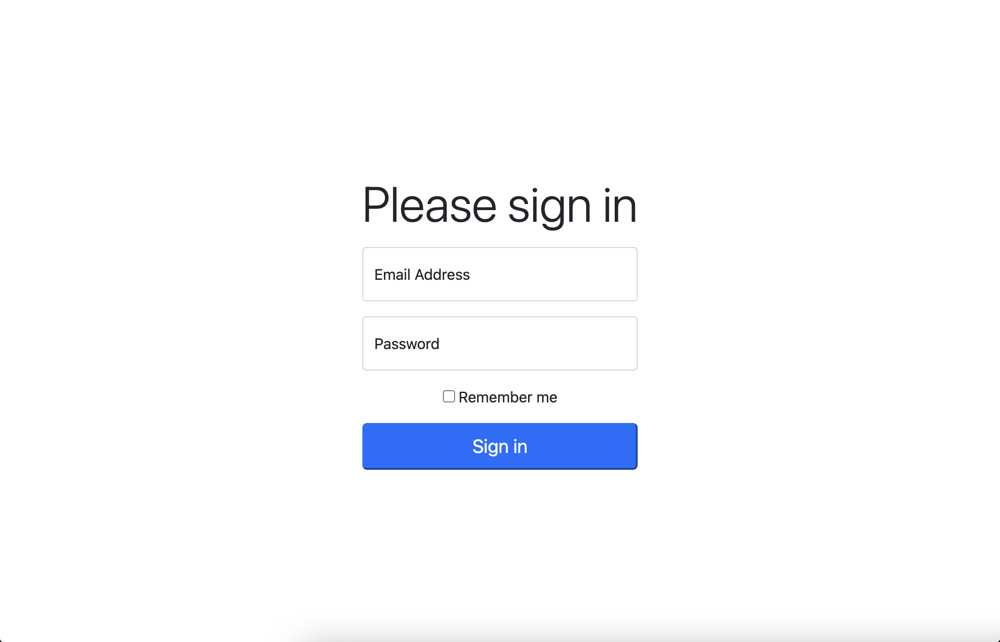

# Fancy Login Page
Your next task for **Bandwidthly** is to make a login form using this [**official Bootstrap example**](https://getbootstrap.com/docs/5.0/examples/sign-in/) as a reference. To view the example's HTML, you'll need to open your browser's inspector and select the `Elements` tab. Once you've got the code open, you only need to worry about the `<form>` element and its children. 

An intern has already linked the Bootstrap CDN and added a few classes to the `<body>` element. Here's a brief rundown on what these classes are doing: 

- `h-100` sets the height of the body to 100% of the browser's height. Setting a height is required to vertically center the body's content.
- `d-flex`, `justify-content-center`, and `align-items-center` are part of Bootstrap's flexbox utilities. When combined, these classes center the content of our page vertically and horizontally. 

They've also added some inline CSS styling to the `<main>` element. They set a `max-width` on `<main>` that will prevent our form inputs from stretching to the edges of the page on larger screen resolutions. 

Good luck! Once you're finished, the page should look something like this:

